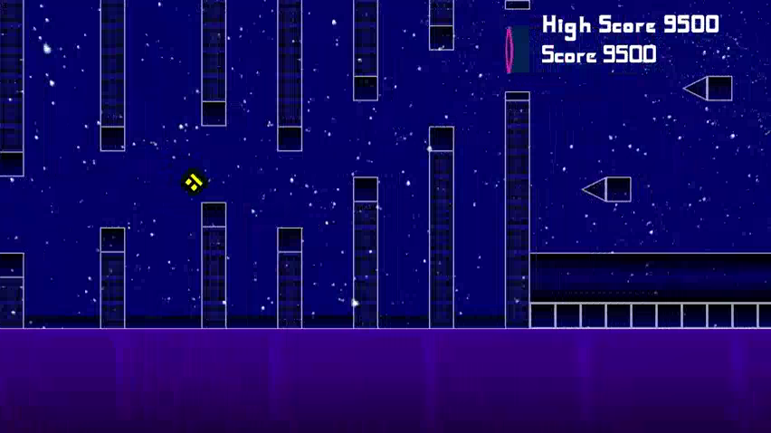

# Edge of the Abyss

A gameplay recording from Level 1 to Level 4 can be viewed [here](documentation/Level%201-4%20Game%20Play.mp4).

## Features
A 2-D obstacle avoiding platformer game with multiple gamemodes as shown below:

* Normal mode where you jump over obstacles
* Reverse gravity mode where gravity is towards the ceiling
* Plane mode where you fly above or below the obstacles

Other noteworthy features include

* Infinite parallax background and ground.
* Triangular and box collisions
* Multiple levels which can be easily modified using [Tiled](https://www.mapeditor.org/)
* Scorekeeping across multiple sessions

## Documentation
More details can be found in the [User](documentation/User%20Manual.md) and [Developer](documentation/Developer%20Manual.md) manuals in the documentation folder. A complete code documentation can be viewed by opening [documentation/html/index.html](documentation/html/index.html) in a browser.

## Installation
You can run the game by downloading the compiled executable from [releases](https://github.com/Taha-Adeel/Edge-of-the-Abyss/releases/tag/v1.0.0), or cloning the repository and building it from the source code. 

The project uses SFML library, so you must have it installed in your system before hand to compile the source code. (See [this for linux](https://www.sfml-dev.org/tutorials/2.5/start-linux.php) and [this for others](https://www.sfml-dev.org/download.php)).

To compile the project on Linux, any of the following commands can be used to build the project:
> make

> make release 

> make run 

To run the final executable (./Edge_of_the_Abyss), run either of the following commands from the root of the project

> make run

> ./Edge_of_the_Abyss

## License
This project is licensed under the terms of the Apache 2.0 license. Read the license file for more information